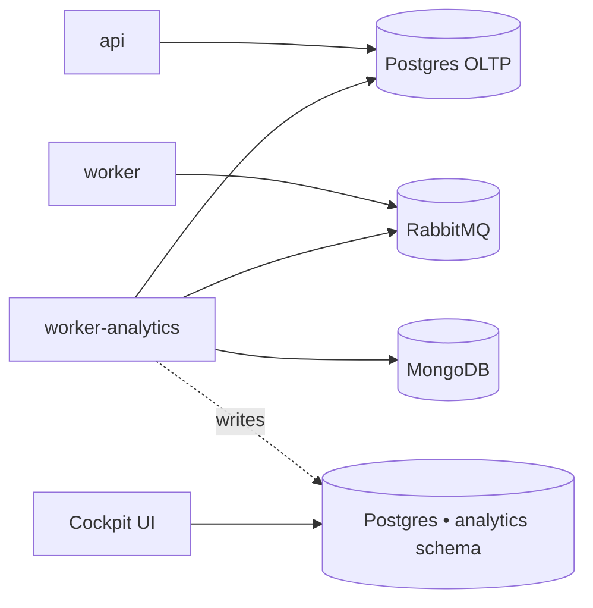

The analytics worker is an **Enterprise-only** add-on. It runs the
ingestion cron that powers the Cockpit dashboards (DORA-style metrics,
PR lifecycle, LLM-based PR classifier).

<Warning>
The default installer **does not** ship this worker. Community self-hosted
deployments don't need it and these vars are filtered out of the default
`.env.example`. Stop here unless you have a self-hosted Enterprise
license and want the Cockpit reports.
</Warning>

## What it does

A separate Node process running the **same image as `worker`** (`kodus-ai-worker`),
selected at boot via `WORKER_ROLE=analytics`. Two crons fire from this
process and only this process:

- **Ingestion** (`ANALYTICS_INGESTION_CRON`, default `*/30 * * * *`) — reads
  pull requests and review sessions from Mongo + the OLTP Postgres, projects
  them into the `analytics` schema.
- **Classifier** (`ANALYTICS_CLASSIFIER_CRON`, default `*/15 * * * *`) — calls
  an LLM to tag each PR with a type (feature/bugfix/refactor/etc).

Isolating it from the main `worker` keeps the code-review event loop
unaffected by long-running ingestion queries.

## Topology

The analytics warehouse is a Postgres **schema**, not a separate database.
Two supported layouts:

- **Shared Postgres (recommended for self-hosted)** — leave the
  `ANALYTICS_PG_DB_*` vars **unset** (commented out, not set to an empty
  value). The config loader cascades to the main `API_PG_DB_*` vars and
  creates an `analytics` schema in the same instance. One DB to back up and
  operate.
- **Dedicated Postgres** — set the full `ANALYTICS_PG_DB_*` block to point
  at a separate instance. Use this when you want analytical queries fully
  isolated from the OLTP write path.



## Enabling on self-hosted Enterprise

### 1. Turn on the `analytics` profile

The `worker-analytics` service ships in the installer's `docker-compose.yml`
behind an opt-in [Compose profile](https://docs.docker.com/compose/profiles/),
so it stays off for community installs. Enable it by adding to your `.env`:

```bash
COMPOSE_PROFILES=analytics
```

It uses the **same image as `worker`** — only `WORKER_ROLE=analytics` (set on
the service in `docker-compose.yml`) flips it into ingestion mode. Leave
`WORKER_ROLE=code-review` in `.env` for the main worker; the analytics
container overrides it.

<Note>
Running a hand-rolled compose (not the Kodus installer)? Add the service
yourself:

```yaml
worker-analytics:
    image: ghcr.io/kodustech/kodus-ai-worker:${IMAGE_TAG:-latest}
    platform: linux/amd64
    container_name: kodus-worker-analytics
    profiles: ["analytics"]
    environment:
        - WORKER_ROLE=analytics
    networks: [shared-network, kodus-backend-services]
    restart: unless-stopped
    env_file: [.env]
    depends_on: [db_kodus_postgres, db_kodus_mongodb, rabbitmq]
```
</Note>

### 2. (Optional) tune the analytics block in `.env`

Defaults work out of the box for the shared-Postgres layout — you only need
this block to change cron schedules or point at a dedicated Postgres.

**Shared Postgres (recommended):** leave the `ANALYTICS_PG_DB_*` connection
vars **unset** (commented out). The loader cascades to the main `API_PG_DB_*`
and creates the `analytics` schema in the same instance.

<Warning>
Do **not** set `ANALYTICS_PG_DB_HOST=` to an empty value — leave it commented
out. An empty string is treated as "set to nothing", which can short-circuit
the fallback to the main Postgres.
</Warning>

```bash
ANALYTICS_PG_DB_SCHEMA=analytics        # default; override only to rename
ANALYTICS_INGESTION_CRON=*/30 * * * *   # default
ANALYTICS_CLASSIFIER_CRON=*/15 * * * *  # default
# No LLM key configured? Disable the PR classifier — DORA / lifecycle
# metrics still work without it:
# ANALYTICS_CLASSIFIER_DISABLED=true
```

**Dedicated Postgres:**

```bash
ANALYTICS_PG_DB_HOST=your-analytics-host
ANALYTICS_PG_DB_PORT=5432
ANALYTICS_PG_DB_USERNAME=analytics
ANALYTICS_PG_DB_PASSWORD=...
ANALYTICS_PG_DB_DATABASE=kodus_analytics
ANALYTICS_PG_DB_SCHEMA=analytics
```

### 3. Boot — migrations run automatically

```bash
COMPOSE_PROFILES=analytics docker compose up -d
```

`worker-analytics` shares the same `prod-entrypoint.sh` as `api`/`worker`. With
`RUN_MIGRATIONS=true` (installer default), the analytics warehouse migrations
run on first boot, creating the `analytics` schema and its tables. The first
ingestion run then imports the PR history Kodus already has in Mongo;
subsequent runs are incremental (by `updatedAt`).

## Reference

| Variable | Description | Default |
|---|---|---|
| `WORKER_ROLE` | Must be set to `analytics` on this container. | _required_ |
| `COMPOSE_PROFILES` | Set to `analytics` to bring the worker up. | _unset_ |
| `ANALYTICS_PG_DB_HOST` | Analytics Postgres host. Unset → reuse main Postgres. | _unset_ |
| `ANALYTICS_PG_DB_PORT` | Analytics Postgres port. | `5432` |
| `ANALYTICS_PG_DB_USERNAME` | Analytics Postgres user. Unset → reuse `API_PG_DB_USERNAME`. | _unset_ |
| `ANALYTICS_PG_DB_PASSWORD` | Analytics Postgres password. Unset → reuse `API_PG_DB_PASSWORD`. | _unset_ |
| `ANALYTICS_PG_DB_DATABASE` | Analytics Postgres database. Unset → reuse `API_PG_DB_DATABASE`. | _unset_ |
| `ANALYTICS_PG_DB_SCHEMA` | Schema name for the warehouse tables. | `analytics` |
| `ANALYTICS_PG_POOL_MAX` | Upper bound on the analytics Postgres pool. | `5` |
| `ANALYTICS_INGESTION_CRON` | Cron schedule for the ingestion run (UTC). | `*/30 * * * *` |
| `ANALYTICS_CLASSIFIER_CRON` | Cron schedule for the LLM PR-type classifier (UTC). | `*/15 * * * *` |

### Pausing ingestion (advanced)

To stop ingestion at runtime without removing the container, set
`ANALYTICS_INGESTION_DISABLED=true` and/or `ANALYTICS_CLASSIFIER_DISABLED=true`
and restart `worker-analytics`. The cron stays scheduled but each tick
short-circuits.

## Verifying it's working

After boot, tail the analytics worker logs:

```bash
docker compose logs -f worker-analytics
```

You should see lines like `analytics ingestion done in NNNms — {...}` every
30 minutes and `analytics classifier done ...` every 15 minutes. If you
don't, check that `WORKER_ROLE=analytics` is set on this container only
(not on the main `worker` — that one must stay `code-review`).
