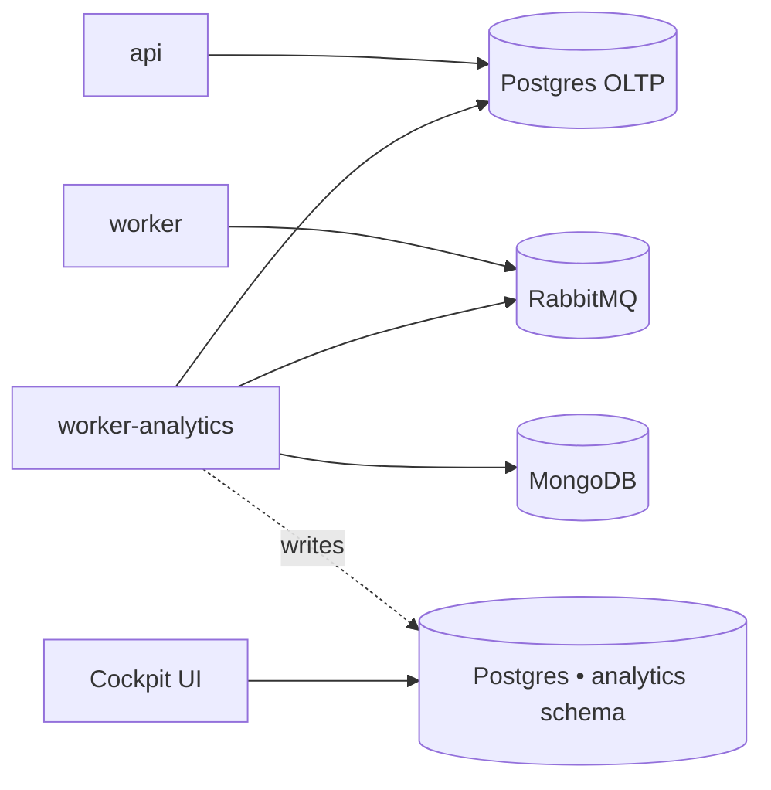

The analytics worker is an **Enterprise-only** add-on. It runs the
ingestion cron that powers the Cockpit dashboards (DORA-style metrics,
PR lifecycle, LLM-based PR classifier).

<Warning>
The default installer **does not** ship this worker. Community self-hosted
deployments don't need it and these vars are filtered out of the default
`.env.example`. Stop here unless you have a self-hosted Enterprise
license and want the Cockpit reports.
</Warning>

## What it does

A separate Node process running the **same image as `worker`** (`kodus-ai-worker`),
selected at boot via `WORKER_ROLE=analytics`. Two crons fire from this
process and only this process:

- **Ingestion** (`ANALYTICS_INGESTION_CRON`, default `*/30 * * * *`) — reads
  pull requests and review sessions from Mongo + the OLTP Postgres, projects
  them into the `analytics` schema.
- **Classifier** (`ANALYTICS_CLASSIFIER_CRON`, default `*/15 * * * *`) — calls
  an LLM to tag each PR with a type (feature/bugfix/refactor/etc).

Isolating it from the main `worker` keeps the code-review event loop
unaffected by long-running ingestion queries.

## Topology

The analytics warehouse is a Postgres **schema**, not a separate database.
Two supported layouts:

- **Shared Postgres (recommended for self-hosted)** — leave
  `ANALYTICS_PG_DB_HOST` empty. The config loader falls back to the main
  `API_PG_DB_*` vars and creates an `analytics` schema in the same instance.
  One DB to back up and operate.
- **Dedicated Postgres** — set the full `ANALYTICS_PG_DB_*` block to point
  at a separate instance. Use this when you want analytical queries fully
  isolated from the OLTP write path.



## Enabling on self-hosted Enterprise

### 1. Add the service to `docker-compose.yml`

```yaml
worker-analytics:
    image: ghcr.io/kodustech/kodus-ai-worker:latest
    platform: linux/amd64
    container_name: kodus-worker-analytics
    environment:
        - ENV=production
        - NODE_ENV=production
        - WORKER_ROLE=analytics
    networks:
        - shared-network
        - kodus-backend-services
    restart: unless-stopped
    env_file:
        - .env
    depends_on:
        - db_kodus_postgres
        - db_kodus_mongodb
        - rabbitmq
```

The image is identical to the `worker` service — only `WORKER_ROLE=analytics`
flips it into ingestion mode.

### 2. Add the analytics block to `.env`

**Shared Postgres (recommended):**

```bash
# Empty ANALYTICS_PG_DB_HOST → loader reuses API_PG_DB_* and creates the
# `analytics` schema in the main instance.
ANALYTICS_PG_DB_HOST=
ANALYTICS_PG_DB_SCHEMA=analytics

# Cron schedules (UTC).
ANALYTICS_INGESTION_CRON=*/30 * * * *
ANALYTICS_CLASSIFIER_CRON=*/15 * * * *
```

**Dedicated Postgres:**

```bash
ANALYTICS_PG_DB_HOST=your-analytics-host
ANALYTICS_PG_DB_PORT=5432
ANALYTICS_PG_DB_USERNAME=analytics
ANALYTICS_PG_DB_PASSWORD=...
ANALYTICS_PG_DB_DATABASE=kodus_analytics
ANALYTICS_PG_DB_SCHEMA=analytics

ANALYTICS_INGESTION_CRON=*/30 * * * *
ANALYTICS_CLASSIFIER_CRON=*/15 * * * *
```

### 3. Boot — migrations run automatically

The `worker-analytics` container shares the same `prod-entrypoint.sh` as
`api`/`worker`/`webhooks`. With `RUN_MIGRATIONS=true` (installer default),
the analytics warehouse migrations (`yarn analytics:migration:run:prod`)
run on first boot, creating the `analytics` schema and its tables.

## Reference

| Variable | Description | Default |
|---|---|---|
| `WORKER_ROLE` | Must be set to `analytics` on this container. | _required_ |
| `ANALYTICS_PG_DB_HOST` | Analytics Postgres host. Empty → reuse main Postgres. | _empty_ |
| `ANALYTICS_PG_DB_PORT` | Analytics Postgres port. | `5432` |
| `ANALYTICS_PG_DB_USERNAME` | Analytics Postgres user. Empty → reuse `API_PG_DB_USERNAME`. | _empty_ |
| `ANALYTICS_PG_DB_PASSWORD` | Analytics Postgres password. Empty → reuse `API_PG_DB_PASSWORD`. | _empty_ |
| `ANALYTICS_PG_DB_DATABASE` | Analytics Postgres database. Empty → reuse `API_PG_DB_DATABASE`. | _empty_ |
| `ANALYTICS_PG_DB_SCHEMA` | Schema name for the warehouse tables. | `analytics` |
| `ANALYTICS_PG_POOL_MAX` | Upper bound on the analytics Postgres pool. | `5` |
| `ANALYTICS_INGESTION_CRON` | Cron schedule for the ingestion run (UTC). | `*/30 * * * *` |
| `ANALYTICS_CLASSIFIER_CRON` | Cron schedule for the LLM PR-type classifier (UTC). | `*/15 * * * *` |

### Pausing ingestion (advanced)

To stop ingestion at runtime without removing the container, set
`ANALYTICS_INGESTION_DISABLED=true` and/or `ANALYTICS_CLASSIFIER_DISABLED=true`
and restart `worker-analytics`. The cron stays scheduled but each tick
short-circuits. Use this for incident triage, not as a long-term config —
they are managed primarily for cloud and may not appear in the installer
template.

## Verifying it's working

After boot, tail the analytics worker logs:

```bash
docker compose logs -f worker-analytics
```

You should see lines like `analytics ingestion done in NNNms — {...}` every
30 minutes and `analytics classifier done ...` every 15 minutes. If you
don't, check that `WORKER_ROLE=analytics` is set on this container only
(not on the main `worker` — that one must stay `code-review`).
