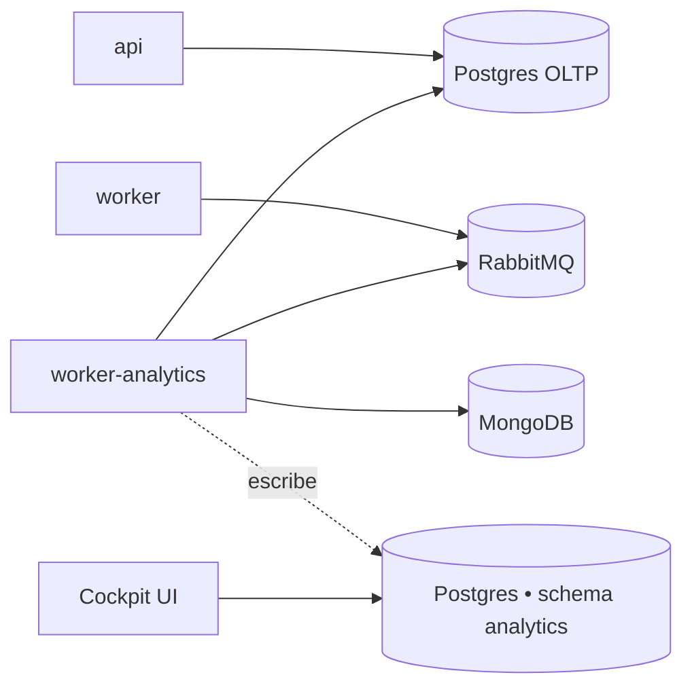

El analytics worker es un add-on **exclusivo de Enterprise**. Ejecuta el
cron de ingestión que alimenta los dashboards del Cockpit (métricas tipo
DORA, ciclo de vida de PR, classifier de PR basado en LLM).

<Warning>
El instalador por defecto **no** incluye este worker. Los despliegues
self-hosted de la versión community no lo necesitan y estas vars se
filtran del `.env.example` por defecto. Detente aquí a menos que tengas
una licencia self-hosted Enterprise y quieras los reportes del Cockpit.
</Warning>

## Qué hace

Un proceso Node separado ejecutando la **misma imagen del `worker`**
(`kodus-ai-worker`), seleccionado en el boot vía `WORKER_ROLE=analytics`.
Dos crons disparan desde este proceso y solo desde él:

- **Ingestión** (`ANALYTICS_INGESTION_CRON`, default `*/30 * * * *`) — lee
  pull requests y sesiones de review desde Mongo + el Postgres OLTP, y los
  proyecta al schema `analytics`.
- **Classifier** (`ANALYTICS_CLASSIFIER_CRON`, default `*/15 * * * *`) —
  llama un LLM para etiquetar cada PR con un tipo (feature/bugfix/refactor/etc).

Aislarlo del `worker` principal mantiene el event loop de code review
libre de queries de ingestión largas.

## Topología

El warehouse de analytics es un **schema** de Postgres, no una base de
datos separada. Dos layouts soportados:

- **Postgres compartido (recomendado para self-hosted)** — deja
  `ANALYTICS_PG_DB_HOST` vacío. El config loader cae en el fallback de
  las vars `API_PG_DB_*` y crea un schema `analytics` en la misma
  instancia. Una sola DB para respaldar y operar.
- **Postgres dedicado** — define el bloque `ANALYTICS_PG_DB_*` apuntando
  a otra instancia. Úsalo cuando quieras queries analíticas totalmente
  aisladas del write path del OLTP.



## Habilitando en self-hosted Enterprise

### 1. Agrega el servicio a `docker-compose.yml`

```yaml
worker-analytics:
    image: ghcr.io/kodustech/kodus-ai-worker:latest
    platform: linux/amd64
    container_name: kodus-worker-analytics
    environment:
        - ENV=production
        - NODE_ENV=production
        - WORKER_ROLE=analytics
    networks:
        - shared-network
        - kodus-backend-services
    restart: unless-stopped
    env_file:
        - .env
    depends_on:
        - db_kodus_postgres
        - db_kodus_mongodb
        - rabbitmq
```

La imagen es idéntica al servicio `worker` — solo `WORKER_ROLE=analytics`
lo cambia a modo ingestión.

### 2. Agrega el bloque de analytics al `.env`

**Postgres compartido (recomendado):**

```bash
# ANALYTICS_PG_DB_HOST vacío → el loader reutiliza API_PG_DB_* y crea
# el schema `analytics` en la instancia principal.
ANALYTICS_PG_DB_HOST=
ANALYTICS_PG_DB_SCHEMA=analytics

# Cron schedules (UTC).
ANALYTICS_INGESTION_CRON=*/30 * * * *
ANALYTICS_CLASSIFIER_CRON=*/15 * * * *
```

**Postgres dedicado:**

```bash
ANALYTICS_PG_DB_HOST=tu-host-de-analytics
ANALYTICS_PG_DB_PORT=5432
ANALYTICS_PG_DB_USERNAME=analytics
ANALYTICS_PG_DB_PASSWORD=...
ANALYTICS_PG_DB_DATABASE=kodus_analytics
ANALYTICS_PG_DB_SCHEMA=analytics

ANALYTICS_INGESTION_CRON=*/30 * * * *
ANALYTICS_CLASSIFIER_CRON=*/15 * * * *
```

### 3. Boot — las migrations corren automáticamente

El contenedor `worker-analytics` comparte el mismo `prod-entrypoint.sh`
que `api`/`worker`/`webhooks`. Con `RUN_MIGRATIONS=true` (default del
installer), las migrations del warehouse de analytics
(`yarn analytics:migration:run:prod`) corren en el primer boot, creando
el schema `analytics` y sus tablas.

## Referencia

| Variable | Descripción | Default |
|---|---|---|
| `WORKER_ROLE` | Debe estar en `analytics` en este contenedor. | _requerido_ |
| `ANALYTICS_PG_DB_HOST` | Host del Postgres de analytics. Vacío → reutiliza el Postgres principal. | _vacío_ |
| `ANALYTICS_PG_DB_PORT` | Puerto del Postgres de analytics. | `5432` |
| `ANALYTICS_PG_DB_USERNAME` | Usuario del Postgres de analytics. Vacío → reutiliza `API_PG_DB_USERNAME`. | _vacío_ |
| `ANALYTICS_PG_DB_PASSWORD` | Contraseña del Postgres de analytics. Vacío → reutiliza `API_PG_DB_PASSWORD`. | _vacío_ |
| `ANALYTICS_PG_DB_DATABASE` | Base del Postgres de analytics. Vacío → reutiliza `API_PG_DB_DATABASE`. | _vacío_ |
| `ANALYTICS_PG_DB_SCHEMA` | Nombre del schema de las tablas del warehouse. | `analytics` |
| `ANALYTICS_PG_POOL_MAX` | Límite superior del pool del Postgres de analytics. | `5` |
| `ANALYTICS_INGESTION_CRON` | Cron schedule de la ingestión (UTC). | `*/30 * * * *` |
| `ANALYTICS_CLASSIFIER_CRON` | Cron schedule del classifier de tipo de PR vía LLM (UTC). | `*/15 * * * *` |

### Pausando la ingestión (avanzado)

Para detener la ingestión en runtime sin remover el contenedor, define
`ANALYTICS_INGESTION_DISABLED=true` y/o `ANALYTICS_CLASSIFIER_DISABLED=true`
y reinicia `worker-analytics`. El cron sigue agendado pero cada tick
hace short-circuit. Úsalo para triaje de incidentes, no como config a
largo plazo — esas vars se gestionan principalmente para cloud y pueden
no aparecer en el template del installer.

## Verificando que funciona

Después del boot, sigue los logs del analytics worker:

```bash
docker compose logs -f worker-analytics
```

Debes ver líneas como `analytics ingestion done in NNNms — {...}` cada
30 minutos y `analytics classifier done ...` cada 15 minutos. Si no,
confirma que `WORKER_ROLE=analytics` está seteado solo en este
contenedor (no en el `worker` principal — ese debe permanecer en
`code-review`).
