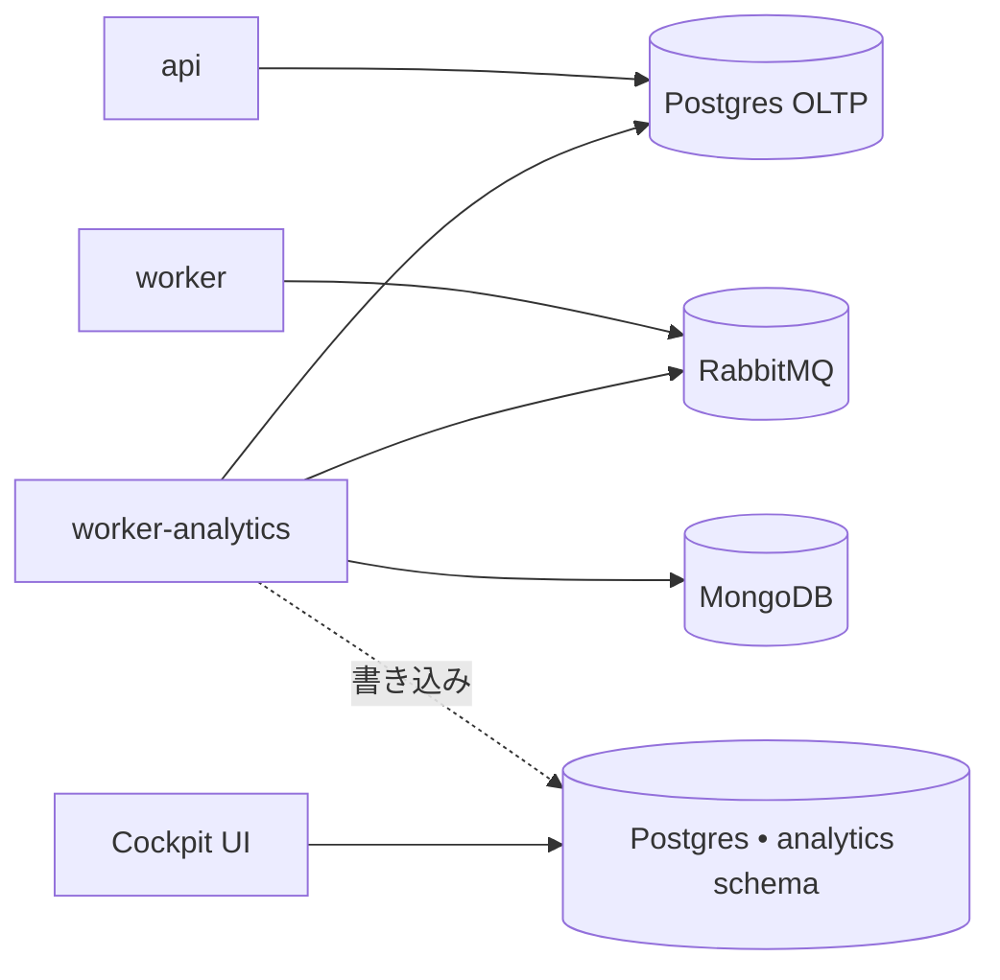

Analytics worker は **Enterprise 専用**のアドオンです。Cockpit
ダッシュボード（DORA 風メトリクス、PR ライフサイクル、LLM ベースの
PR classifier）を駆動する取り込み cron を実行します。

<Warning>
デフォルトのインストーラーはこのワーカーを**含みません**。コミュニティ
版のセルフホストデプロイメントには不要で、これらの変数はデフォルトの
`.env.example` からフィルタリングされています。セルフホスト Enterprise
ライセンスを持っていて、Cockpit のレポートが必要な場合のみ進めてください。
</Warning>

## 何をするか

`worker` と**同じイメージ**（`kodus-ai-worker`）を実行する別プロセスで、
boot 時に `WORKER_ROLE=analytics` で選択されます。このプロセスからのみ
2 つの cron が起動します:

- **取り込み**（`ANALYTICS_INGESTION_CRON`、デフォルト `*/30 * * * *`）
  — Mongo + OLTP Postgres から pull request とレビューセッションを読み、
  `analytics` schema に投影します。
- **Classifier**（`ANALYTICS_CLASSIFIER_CRON`、デフォルト
  `*/15 * * * *`） — LLM を呼び出して各 PR にタイプ
  （feature/bugfix/refactor/etc）をタグ付けします。

メインの `worker` から分離することで、code review の event loop が
長時間の取り込みクエリの影響を受けないようにします。

## トポロジー

Analytics warehouse は別の DB ではなく Postgres の **schema** です。
2 つのレイアウトがサポートされています:

- **共有 Postgres（セルフホスト推奨）** — `ANALYTICS_PG_DB_HOST` を空に
  します。設定ローダーが `API_PG_DB_*` 変数にフォールバックし、同じ
  インスタンスに `analytics` schema を作成します。バックアップと運用は
  1 つの DB だけ。
- **専用 Postgres** — 別のインスタンスを指す `ANALYTICS_PG_DB_*` 全体を
  設定します。OLTP の write path から完全に分離した分析クエリが必要な
  場合に使用します。



## セルフホスト Enterprise での有効化

### 1. `docker-compose.yml` にサービスを追加

```yaml
worker-analytics:
    image: ghcr.io/kodustech/kodus-ai-worker:latest
    platform: linux/amd64
    container_name: kodus-worker-analytics
    environment:
        - ENV=production
        - NODE_ENV=production
        - WORKER_ROLE=analytics
    networks:
        - shared-network
        - kodus-backend-services
    restart: unless-stopped
    env_file:
        - .env
    depends_on:
        - db_kodus_postgres
        - db_kodus_mongodb
        - rabbitmq
```

イメージは `worker` サービスと同一です — `WORKER_ROLE=analytics` だけが
取り込みモードに切り替えます。

### 2. `.env` に analytics ブロックを追加

**共有 Postgres（推奨）:**

```bash
# ANALYTICS_PG_DB_HOST が空 → ローダーは API_PG_DB_* を再利用し、
# メインインスタンスに `analytics` schema を作成します。
ANALYTICS_PG_DB_HOST=
ANALYTICS_PG_DB_SCHEMA=analytics

# Cron schedules (UTC).
ANALYTICS_INGESTION_CRON=*/30 * * * *
ANALYTICS_CLASSIFIER_CRON=*/15 * * * *
```

**専用 Postgres:**

```bash
ANALYTICS_PG_DB_HOST=your-analytics-host
ANALYTICS_PG_DB_PORT=5432
ANALYTICS_PG_DB_USERNAME=analytics
ANALYTICS_PG_DB_PASSWORD=...
ANALYTICS_PG_DB_DATABASE=kodus_analytics
ANALYTICS_PG_DB_SCHEMA=analytics

ANALYTICS_INGESTION_CRON=*/30 * * * *
ANALYTICS_CLASSIFIER_CRON=*/15 * * * *
```

### 3. Boot — マイグレーションが自動実行されます

`worker-analytics` コンテナは `api`/`worker`/`webhooks` と同じ
`prod-entrypoint.sh` を共有します。`RUN_MIGRATIONS=true`（インストーラー
のデフォルト）の場合、analytics warehouse のマイグレーション
（`yarn analytics:migration:run:prod`）が初回 boot で実行され、
`analytics` schema とそのテーブルが作成されます。

## リファレンス

| 変数 | 説明 | デフォルト |
|---|---|---|
| `WORKER_ROLE` | このコンテナでは `analytics` に設定する必要があります。 | _必須_ |
| `ANALYTICS_PG_DB_HOST` | Analytics Postgres ホスト。空 → メイン Postgres を再利用。 | _空_ |
| `ANALYTICS_PG_DB_PORT` | Analytics Postgres ポート。 | `5432` |
| `ANALYTICS_PG_DB_USERNAME` | Analytics Postgres ユーザー。空 → `API_PG_DB_USERNAME` を再利用。 | _空_ |
| `ANALYTICS_PG_DB_PASSWORD` | Analytics Postgres パスワード。空 → `API_PG_DB_PASSWORD` を再利用。 | _空_ |
| `ANALYTICS_PG_DB_DATABASE` | Analytics Postgres データベース。空 → `API_PG_DB_DATABASE` を再利用。 | _空_ |
| `ANALYTICS_PG_DB_SCHEMA` | Warehouse テーブルの schema 名。 | `analytics` |
| `ANALYTICS_PG_POOL_MAX` | Analytics Postgres プールの上限。 | `5` |
| `ANALYTICS_INGESTION_CRON` | 取り込み実行の cron schedule（UTC）。 | `*/30 * * * *` |
| `ANALYTICS_CLASSIFIER_CRON` | LLM PR タイプ classifier の cron schedule（UTC）。 | `*/15 * * * *` |

### 取り込みの一時停止（高度）

コンテナを削除せずに runtime で取り込みを停止するには、
`ANALYTICS_INGESTION_DISABLED=true` および/または
`ANALYTICS_CLASSIFIER_DISABLED=true` を設定し、`worker-analytics` を
再起動してください。Cron はスケジュールされたままですが、各 tick が
ショートサーキットします。これはインシデントトリアージ用で、長期設定
としては使わないでください — これらの変数は主にクラウド向けに管理されて
おり、インストーラーテンプレートには表示されない場合があります。

## 動作の確認

Boot 後、analytics worker のログを追跡します:

```bash
docker compose logs -f worker-analytics
```

30 分ごとに `analytics ingestion done in NNNms — {...}` のような行と、
15 分ごとに `analytics classifier done ...` が表示されるはずです。
表示されない場合は、`WORKER_ROLE=analytics` がこのコンテナにのみ
設定されていることを確認してください（メインの `worker` には設定しない
こと — そちらは `code-review` のままにする必要があります）。
