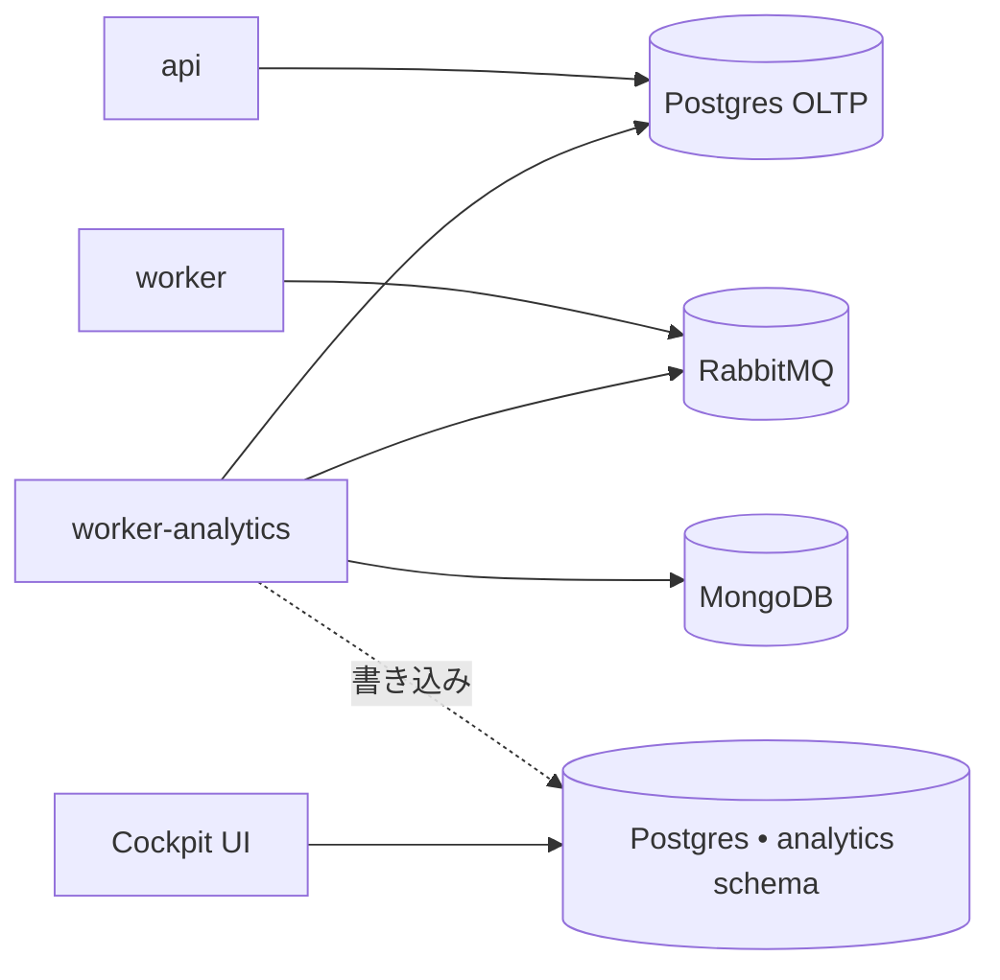

Analytics worker は **Enterprise 専用**のアドオンです。Cockpit
ダッシュボード（DORA 風メトリクス、PR ライフサイクル、LLM ベースの
PR classifier）を駆動する取り込み cron を実行します。

<Warning>
デフォルトのインストーラーはこのワーカーを**含みません**。コミュニティ
版のセルフホストデプロイメントには不要で、これらの変数はデフォルトの
`.env.example` からフィルタリングされています。セルフホスト Enterprise
ライセンスを持っていて、Cockpit のレポートが必要な場合のみ進めてください。
</Warning>

## 何をするか

`worker` と**同じイメージ**（`kodus-ai-worker`）を実行する別プロセスで、
boot 時に `WORKER_ROLE=analytics` で選択されます。このプロセスからのみ
2 つの cron が起動します:

- **取り込み**（`ANALYTICS_INGESTION_CRON`、デフォルト `*/30 * * * *`）
  — Mongo + OLTP Postgres から pull request とレビューセッションを読み、
  `analytics` schema に投影します。
- **Classifier**（`ANALYTICS_CLASSIFIER_CRON`、デフォルト
  `*/15 * * * *`） — LLM を呼び出して各 PR にタイプ
  （feature/bugfix/refactor/etc）をタグ付けします。

メインの `worker` から分離することで、code review の event loop が
長時間の取り込みクエリの影響を受けないようにします。

## トポロジー

Analytics warehouse は別の DB ではなく Postgres の **schema** です。
2 つのレイアウトがサポートされています:

- **共有 Postgres（セルフホスト推奨）** — `ANALYTICS_PG_DB_*` 変数を
  **未設定**のまま（コメントアウト。空文字に**しない**）にします。設定
  ローダーが `API_PG_DB_*` 変数にフォールバックし、同じインスタンスに
  `analytics` schema を作成します。バックアップと運用は 1 つの DB だけ。
- **専用 Postgres** — 別のインスタンスを指す `ANALYTICS_PG_DB_*` 全体を
  設定します。OLTP の write path から完全に分離した分析クエリが必要な
  場合に使用します。



## セルフホスト Enterprise での有効化

### 1. `analytics` プロファイルを有効化

`worker-analytics` サービスはインストーラーの `docker-compose.yml` に
オプトインの [Compose プロファイル](https://docs.docker.com/compose/profiles/)
として同梱されており、community インストールではオフです。`.env` に次を
追加して有効化します:

```bash
COMPOSE_PROFILES=analytics
```

`worker` と**同一のイメージ**を使用し、`docker-compose.yml` 側で設定された
`WORKER_ROLE=analytics` だけが取り込みモードに切り替えます。`.env` の
`WORKER_ROLE=code-review`（メイン worker 用）はそのままにしてください。
analytics コンテナがそれを上書きします。

<Note>
インストーラーを使わず compose を手書きしている場合は、サービスを自分で
追加してください:

```yaml
worker-analytics:
    image: ghcr.io/kodustech/kodus-ai-worker:${IMAGE_TAG:-latest}
    platform: linux/amd64
    container_name: kodus-worker-analytics
    profiles: ["analytics"]
    environment:
        - WORKER_ROLE=analytics
    networks: [shared-network, kodus-backend-services]
    restart: unless-stopped
    env_file: [.env]
    depends_on: [db_kodus_postgres, db_kodus_mongodb, rabbitmq]
```
</Note>

### 2.（任意）`.env` の analytics ブロックを調整

共有 Postgres レイアウトではデフォルトでそのまま動作します。このブロックは
cron スケジュールの変更や専用 Postgres を指す場合のみ必要です。

**共有 Postgres（推奨）:** 接続用の `ANALYTICS_PG_DB_*` 変数は**未設定**
（コメントアウト）のままにします。ローダーが `API_PG_DB_*` にフォール
バックし、同じインスタンスに `analytics` schema を作成します。

<Warning>
`ANALYTICS_PG_DB_HOST=` を空文字に**しない**でください — コメントアウトの
まま残します。空文字は「空に設定済み」として扱われ、メイン Postgres への
フォールバックを妨げる可能性があります。
</Warning>

```bash
ANALYTICS_PG_DB_SCHEMA=analytics        # デフォルト。改名する場合のみ変更
ANALYTICS_INGESTION_CRON=*/30 * * * *   # デフォルト
ANALYTICS_CLASSIFIER_CRON=*/15 * * * *  # デフォルト
# LLM キーが未設定？ classifier を無効化（DORA / ライフサイクル指標は
# それなしでも動作します）:
# ANALYTICS_CLASSIFIER_DISABLED=true
```

**専用 Postgres:**

```bash
ANALYTICS_PG_DB_HOST=your-analytics-host
ANALYTICS_PG_DB_PORT=5432
ANALYTICS_PG_DB_USERNAME=analytics
ANALYTICS_PG_DB_PASSWORD=...
ANALYTICS_PG_DB_DATABASE=kodus_analytics
ANALYTICS_PG_DB_SCHEMA=analytics
```

### 3. Boot — マイグレーションが自動実行されます

```bash
COMPOSE_PROFILES=analytics docker compose up -d
```

`worker-analytics` は `api`/`worker` と同じ `prod-entrypoint.sh` を共有します。
`RUN_MIGRATIONS=true`（インストーラーのデフォルト）の場合、analytics
warehouse のマイグレーションが初回 boot で実行され、`analytics` schema と
そのテーブルが作成されます。最初の取り込み実行で、Kodus が Mongo に既に
持っている PR 履歴が取り込まれ、以降は（`updatedAt` による）増分実行に
なります。

## リファレンス

| 変数 | 説明 | デフォルト |
|---|---|---|
| `COMPOSE_PROFILES` | `analytics` に設定すると worker が起動します。 | _未設定_ |
| `WORKER_ROLE` | このコンテナでは `analytics` に設定する必要があります。 | _必須_ |
| `ANALYTICS_PG_DB_HOST` | Analytics Postgres ホスト。未設定 → メイン Postgres を再利用。 | _未設定_ |
| `ANALYTICS_PG_DB_PORT` | Analytics Postgres ポート。 | `5432` |
| `ANALYTICS_PG_DB_USERNAME` | Analytics Postgres ユーザー。未設定 → `API_PG_DB_USERNAME` を再利用。 | _未設定_ |
| `ANALYTICS_PG_DB_PASSWORD` | Analytics Postgres パスワード。未設定 → `API_PG_DB_PASSWORD` を再利用。 | _未設定_ |
| `ANALYTICS_PG_DB_DATABASE` | Analytics Postgres データベース。未設定 → `API_PG_DB_DATABASE` を再利用。 | _未設定_ |
| `ANALYTICS_PG_DB_SCHEMA` | Warehouse テーブルの schema 名。 | `analytics` |
| `ANALYTICS_PG_POOL_MAX` | Analytics Postgres プールの上限。 | `5` |
| `ANALYTICS_INGESTION_CRON` | 取り込み実行の cron schedule（UTC）。 | `*/30 * * * *` |
| `ANALYTICS_CLASSIFIER_CRON` | LLM PR タイプ classifier の cron schedule（UTC）。 | `*/15 * * * *` |

### 取り込みの一時停止（高度）

コンテナを削除せずに runtime で取り込みを停止するには、
`ANALYTICS_INGESTION_DISABLED=true` および/または
`ANALYTICS_CLASSIFIER_DISABLED=true` を設定し、`worker-analytics` を
再起動してください。Cron はスケジュールされたままですが、各 tick が
ショートサーキットします。

## 動作の確認

Boot 後、analytics worker のログを追跡します:

```bash
docker compose logs -f worker-analytics
```

30 分ごとに `analytics ingestion done in NNNms — {...}` のような行と、
15 分ごとに `analytics classifier done ...` が表示されるはずです。
表示されない場合は、`WORKER_ROLE=analytics` がこのコンテナにのみ
設定されていることを確認してください（メインの `worker` には設定しない
こと — そちらは `code-review` のままにする必要があります）。
