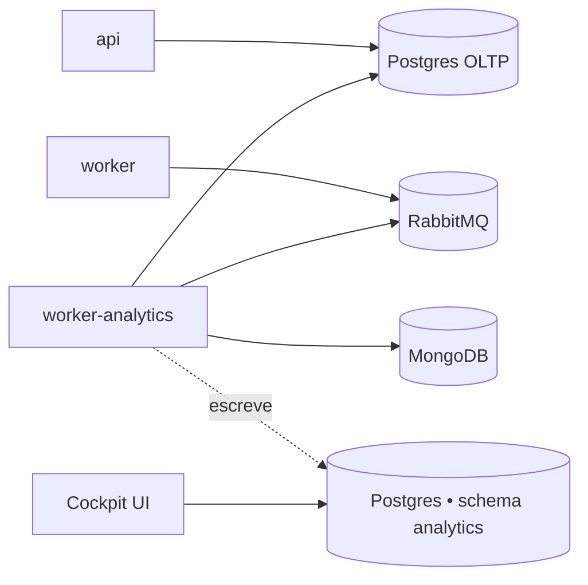

O analytics worker é um add-on **exclusivo do Enterprise**. Ele roda o cron
de ingestão que alimenta os dashboards do Cockpit (métricas tipo DORA,
ciclo de vida de PR, classifier de PR baseado em LLM).

<Warning>
O instalador padrão **não** inclui esse worker. Deploys self-hosted da
versão community não precisam dele e essas vars são filtradas do
`.env.example` padrão. Pare por aqui a menos que você tenha uma licença
self-hosted Enterprise e queira os relatórios do Cockpit.
</Warning>

## O que ele faz

Um processo Node separado rodando a **mesma imagem do `worker`**
(`kodus-ai-worker`), selecionado no boot via `WORKER_ROLE=analytics`.
Dois crons disparam desse processo e somente dele:

- **Ingestão** (`ANALYTICS_INGESTION_CRON`, default `*/30 * * * *`) — lê
  pull requests e sessões de review do Mongo + do Postgres OLTP, projeta
  no schema `analytics`.
- **Classifier** (`ANALYTICS_CLASSIFIER_CRON`, default `*/15 * * * *`) —
  chama uma LLM pra classificar cada PR (feature/bugfix/refactor/etc).

Isolar do `worker` principal mantém o event loop de code review livre
de queries de ingestão longas.

## Topologia

O warehouse de analytics é um **schema** Postgres, não um banco
separado. Dois layouts suportados:

- **Postgres compartilhado (recomendado para self-hosted)** — deixe as vars
  `ANALYTICS_PG_DB_*` **sem definir** (comentadas, **não** setadas como vazio).
  O config loader cai no fallback das vars `API_PG_DB_*` e cria o schema
  `analytics` na mesma instância. Um banco só pra fazer backup e operar.
- **Postgres dedicado** — preencha o bloco `ANALYTICS_PG_DB_*` apontando
  pra outra instância. Use isso quando quer queries analíticas totalmente
  isoladas do write path do OLTP.



## Habilitando no self-hosted Enterprise

### 1. Ligue o profile `analytics`

O serviço `worker-analytics` já vem no `docker-compose.yml` do installer,
atrás de um [profile do Compose](https://docs.docker.com/compose/profiles/)
opt-in — então fica desligado em installs community. Habilite adicionando ao
seu `.env`:

```bash
COMPOSE_PROFILES=analytics
```

Ele usa a **mesma imagem do `worker`** — só `WORKER_ROLE=analytics` (setado no
serviço, no `docker-compose.yml`) muda pra modo ingestão. Mantenha
`WORKER_ROLE=code-review` no `.env` (worker principal); o container de
analytics sobrescreve.

<Note>
Usa um compose montado na mão (sem o installer da Kodus)? Adicione o serviço:

```yaml
worker-analytics:
    image: ghcr.io/kodustech/kodus-ai-worker:${IMAGE_TAG:-latest}
    platform: linux/amd64
    container_name: kodus-worker-analytics
    profiles: ["analytics"]
    environment:
        - WORKER_ROLE=analytics
    networks: [shared-network, kodus-backend-services]
    restart: unless-stopped
    env_file: [.env]
    depends_on: [db_kodus_postgres, db_kodus_mongodb, rabbitmq]
```
</Note>

### 2. (Opcional) ajuste o bloco de analytics no `.env`

Os defaults já funcionam pro layout de Postgres compartilhado — esse bloco só
é preciso pra mudar os crons ou apontar pra um Postgres dedicado.

**Postgres compartilhado (recomendado):** deixe as vars de conexão
`ANALYTICS_PG_DB_*` **sem definir** (comentadas). O loader cai no fallback do
`API_PG_DB_*` e cria o schema `analytics` na mesma instância.

<Warning>
**Não** sete `ANALYTICS_PG_DB_HOST=` vazio — deixe comentado. String vazia é
tratada como "definido como nada" e pode curto-circuitar o fallback pro
Postgres principal.
</Warning>

```bash
ANALYTICS_PG_DB_SCHEMA=analytics        # default; só mude pra renomear
ANALYTICS_INGESTION_CRON=*/30 * * * *   # default
ANALYTICS_CLASSIFIER_CRON=*/15 * * * *  # default
# Sem LLM key configurada? Desligue o classifier — métricas DORA / ciclo de
# vida funcionam sem ele:
# ANALYTICS_CLASSIFIER_DISABLED=true
```

**Postgres dedicado:**

```bash
ANALYTICS_PG_DB_HOST=seu-host-de-analytics
ANALYTICS_PG_DB_PORT=5432
ANALYTICS_PG_DB_USERNAME=analytics
ANALYTICS_PG_DB_PASSWORD=...
ANALYTICS_PG_DB_DATABASE=kodus_analytics
ANALYTICS_PG_DB_SCHEMA=analytics
```

### 3. Boot — migrations rodam automaticamente

```bash
COMPOSE_PROFILES=analytics docker compose up -d
```

O `worker-analytics` compartilha o mesmo `prod-entrypoint.sh` do `api`/`worker`.
Com `RUN_MIGRATIONS=true` (default do installer), as migrations do warehouse
rodam no primeiro boot, criando o schema `analytics` e suas tabelas. A primeira
run de ingestão então importa o histórico de PRs que a Kodus já tem no Mongo;
as runs seguintes são incrementais (por `updatedAt`).

## Referência

| Variável | Descrição | Default |
|---|---|---|
| `COMPOSE_PROFILES` | Defina como `analytics` pra subir o worker. | _não def._ |
| `WORKER_ROLE` | Tem que ser `analytics` nesse container. | _obrigatório_ |
| `ANALYTICS_PG_DB_HOST` | Host do Postgres de analytics. Não definido → reusa o Postgres principal. | _não def._ |
| `ANALYTICS_PG_DB_PORT` | Porta do Postgres de analytics. | `5432` |
| `ANALYTICS_PG_DB_USERNAME` | Usuário do Postgres de analytics. Não definido → reusa `API_PG_DB_USERNAME`. | _não def._ |
| `ANALYTICS_PG_DB_PASSWORD` | Senha do Postgres de analytics. Não definido → reusa `API_PG_DB_PASSWORD`. | _não def._ |
| `ANALYTICS_PG_DB_DATABASE` | Banco do Postgres de analytics. Não definido → reusa `API_PG_DB_DATABASE`. | _não def._ |
| `ANALYTICS_PG_DB_SCHEMA` | Nome do schema das tabelas do warehouse. | `analytics` |
| `ANALYTICS_PG_POOL_MAX` | Limite superior do pool do Postgres de analytics. | `5` |
| `ANALYTICS_INGESTION_CRON` | Cron schedule da ingestão (UTC). | `*/30 * * * *` |
| `ANALYTICS_CLASSIFIER_CRON` | Cron schedule do classifier de tipo de PR via LLM (UTC). | `*/15 * * * *` |

### Pausando a ingestão (avançado)

Pra parar a ingestão em runtime sem remover o container, defina
`ANALYTICS_INGESTION_DISABLED=true` e/ou `ANALYTICS_CLASSIFIER_DISABLED=true`
e reinicie o `worker-analytics`. O cron continua agendado mas cada tick
faz short-circuit.

## Verificando que está funcionando

Após o boot, acompanhe os logs do analytics worker:

```bash
docker compose logs -f worker-analytics
```

Você deve ver linhas como `analytics ingestion done in NNNms — {...}` a
cada 30 minutos e `analytics classifier done ...` a cada 15 minutos.
Se não, confirme que `WORKER_ROLE=analytics` está setado só nesse
container (não no `worker` principal — esse tem que continuar
`code-review`).
