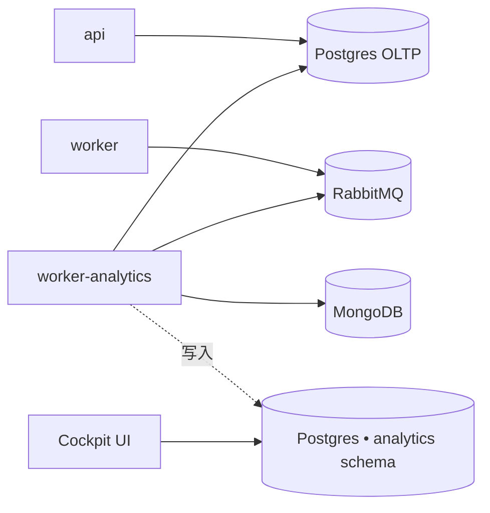

Analytics worker 是**仅限企业版**的附加组件。它运行驱动 Cockpit 仪表板
（DORA 风格指标、PR 生命周期、基于 LLM 的 PR classifier）的摄取 cron。

<Warning>
analytics worker **默认不启动** — 它由 Compose 的 `analytics` profile 控制，
因此普通的 `docker compose up` 永远不会启动它，社区版自托管部署不会为它付出
任何代价。`ANALYTICS_*` 变量在 `.env.example` 中以注释形式提供。除非您拥有
自托管企业版许可证并需要 Cockpit 报告，否则请在此停止。
</Warning>

## 它做什么

一个独立的 Node 进程，运行**与 `worker` 相同的镜像**（`kodus-ai-worker`），
在启动时通过 `WORKER_ROLE=analytics` 选择。两个 cron 仅从这个进程触发：

- **摄取**（`ANALYTICS_INGESTION_CRON`，默认 `*/30 * * * *`）— 从 Mongo
  和 OLTP Postgres 读取 pull request 和 review 会话，将它们投影到
  `analytics` schema。
- **Classifier**（`ANALYTICS_CLASSIFIER_CRON`，默认 `*/15 * * * *`）—
  调用 LLM 为每个 PR 标记类型（feature/bugfix/refactor 等）。

将其与主 `worker` 隔离可使 code review 事件循环不受长时间运行的摄取
查询影响。

## 拓扑

Analytics 仓库是一个 Postgres **schema**，而不是单独的数据库。
支持两种布局：

- **共享 Postgres（自托管推荐）** — 将 `ANALYTICS_PG_DB_*` 变量保持
  **未设置**（注释掉，**不要**设为空值）。配置加载器会回退到主
  `API_PG_DB_*` 变量，并在同一实例中创建 `analytics` schema。只需备份
  和操作一个数据库。
- **专用 Postgres** — 设置完整的 `ANALYTICS_PG_DB_*` 块以指向单独的
  实例。当您希望分析查询与 OLTP 写路径完全隔离时使用此选项。



## 在自托管企业版上启用

### 1. 启用 `analytics` profile

`worker-analytics` 服务已包含在安装程序的 `docker-compose.yml` 中，位于一个
可选启用的 [Compose profile](https://docs.docker.com/compose/profiles/) 之后，
因此社区版安装默认关闭。在 `.env` 中添加以下内容来启用：

```bash
COMPOSE_PROFILES=analytics
```

它使用与 `worker` **相同的镜像** — 只有（在 `docker-compose.yml` 服务中设置的）
`WORKER_ROLE=analytics` 将其切换到摄取模式。请在 `.env` 中保留
`WORKER_ROLE=code-review`（主 worker）；analytics 容器会覆盖它。

<Note>
使用手写的 compose（未用 Kodus 安装程序）？请自行添加该服务：

```yaml
worker-analytics:
    image: ghcr.io/kodustech/kodus-ai-worker:${IMAGE_TAG:-latest}
    platform: linux/amd64
    container_name: kodus-worker-analytics
    profiles: ["analytics"]
    environment:
        - WORKER_ROLE=analytics
    networks: [shared-network, kodus-backend-services]
    restart: unless-stopped
    env_file: [.env]
    depends_on: [db_kodus_postgres, db_kodus_mongodb, rabbitmq]
```
</Note>

### 2.（可选）在 `.env` 中调整 analytics 块

对于共享 Postgres 布局，默认值开箱即用 — 仅当需要更改 cron 计划或指向专用
Postgres 时才需要此块。

**共享 Postgres（推荐）：** 将连接相关的 `ANALYTICS_PG_DB_*` 变量保持
**未设置**（注释掉）。加载器会回退到主 `API_PG_DB_*` 并在同一实例中创建
`analytics` schema。

<Warning>
**不要**将 `ANALYTICS_PG_DB_HOST=` 设为空值 — 请保持注释状态。空字符串会被
当作“已设置为空”，可能会短路到主 Postgres 的回退逻辑。
</Warning>

```bash
ANALYTICS_PG_DB_SCHEMA=analytics        # 默认值；仅在重命名时更改
ANALYTICS_INGESTION_CRON=*/30 * * * *   # 默认值
ANALYTICS_CLASSIFIER_CRON=*/15 * * * *  # 默认值
# 未配置 LLM key？禁用 classifier（DORA / 生命周期指标在没有它时仍可工作）：
# ANALYTICS_CLASSIFIER_DISABLED=true
```

**专用 Postgres：**

```bash
ANALYTICS_PG_DB_HOST=your-analytics-host
ANALYTICS_PG_DB_PORT=5432
ANALYTICS_PG_DB_USERNAME=analytics
ANALYTICS_PG_DB_PASSWORD=...
ANALYTICS_PG_DB_DATABASE=kodus_analytics
ANALYTICS_PG_DB_SCHEMA=analytics
```

### 3. 启动 — 自动运行 migrations

```bash
COMPOSE_PROFILES=analytics docker compose up -d
```

`worker-analytics` 与 `api`/`worker` 共享相同的 `prod-entrypoint.sh`。当
`RUN_MIGRATIONS=true`（安装程序默认）时，analytics 仓库的 migrations 会在
首次启动时运行，创建 `analytics` schema 及其表。首次摄取运行会导入 Kodus
已在 Mongo 中的 PR 历史；后续运行为增量（按 `updatedAt`）。

## 参考

| 变量 | 描述 | 默认值 |
|---|---|---|
| `COMPOSE_PROFILES` | 设为 `analytics` 以启动该 worker。 | _未设置_ |
| `WORKER_ROLE` | 在此容器上必须设置为 `analytics`。 | _必需_ |
| `ANALYTICS_PG_DB_HOST` | Analytics Postgres 主机。未设置 → 复用主 Postgres。 | _未设置_ |
| `ANALYTICS_PG_DB_PORT` | Analytics Postgres 端口。 | `5432` |
| `ANALYTICS_PG_DB_USERNAME` | Analytics Postgres 用户。未设置 → 复用 `API_PG_DB_USERNAME`。 | _未设置_ |
| `ANALYTICS_PG_DB_PASSWORD` | Analytics Postgres 密码。未设置 → 复用 `API_PG_DB_PASSWORD`。 | _未设置_ |
| `ANALYTICS_PG_DB_DATABASE` | Analytics Postgres 数据库。未设置 → 复用 `API_PG_DB_DATABASE`。 | _未设置_ |
| `ANALYTICS_PG_DB_SCHEMA` | 仓库表的 schema 名。 | `analytics` |
| `ANALYTICS_PG_POOL_MAX` | Analytics Postgres 连接池上限。 | `5` |
| `ANALYTICS_INGESTION_CRON` | 摄取运行的 cron schedule（UTC）。 | `*/30 * * * *` |
| `ANALYTICS_CLASSIFIER_CRON` | LLM PR 类型 classifier 的 cron schedule（UTC）。 | `*/15 * * * *` |

### 暂停摄取（高级）

要在运行时停止摄取而不删除容器，请设置
`ANALYTICS_INGESTION_DISABLED=true` 和/或
`ANALYTICS_CLASSIFIER_DISABLED=true`，然后重启 `worker-analytics`。
Cron 仍然按计划运行，但每次 tick 都会短路。

## 验证是否正常运行

启动后，跟踪 analytics worker 日志：

```bash
docker compose logs -f worker-analytics
```

您应该每 30 分钟看到类似 `analytics ingestion done in NNNms — {...}`
的行，每 15 分钟看到 `analytics classifier done ...`。如果没有，请确认
`WORKER_ROLE=analytics` 仅在此容器上设置（不在主 `worker` 上 — 主
`worker` 必须保持为 `code-review`）。
