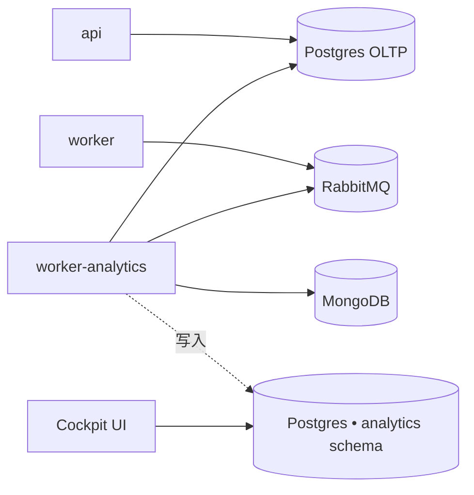

Analytics worker 是**仅限企业版**的附加组件。它运行驱动 Cockpit 仪表板
（DORA 风格指标、PR 生命周期、基于 LLM 的 PR classifier）的摄取 cron。

<Warning>
默认安装程序**不**包含此 worker。社区版自托管部署不需要它，并且这些
变量已从默认 `.env.example` 中过滤掉。除非您拥有自托管企业版许可证
并需要 Cockpit 报告，否则请在此停止。
</Warning>

## 它做什么

一个独立的 Node 进程，运行**与 `worker` 相同的镜像**（`kodus-ai-worker`），
在启动时通过 `WORKER_ROLE=analytics` 选择。两个 cron 仅从这个进程触发：

- **摄取**（`ANALYTICS_INGESTION_CRON`，默认 `*/30 * * * *`）— 从 Mongo
  和 OLTP Postgres 读取 pull request 和 review 会话，将它们投影到
  `analytics` schema。
- **Classifier**（`ANALYTICS_CLASSIFIER_CRON`，默认 `*/15 * * * *`）—
  调用 LLM 为每个 PR 标记类型（feature/bugfix/refactor 等）。

将其与主 `worker` 隔离可使 code review 事件循环不受长时间运行的摄取
查询影响。

## 拓扑

Analytics 仓库是一个 Postgres **schema**，而不是单独的数据库。
支持两种布局：

- **共享 Postgres（自托管推荐）** — 将 `ANALYTICS_PG_DB_HOST` 留空。
  配置加载器会回退到主 `API_PG_DB_*` 变量，并在同一实例中创建
  `analytics` schema。只需备份和操作一个数据库。
- **专用 Postgres** — 设置完整的 `ANALYTICS_PG_DB_*` 块以指向单独的
  实例。当您希望分析查询与 OLTP 写路径完全隔离时使用此选项。



## 在自托管企业版上启用

### 1. 将服务添加到 `docker-compose.yml`

```yaml
worker-analytics:
    image: ghcr.io/kodustech/kodus-ai-worker:latest
    platform: linux/amd64
    container_name: kodus-worker-analytics
    environment:
        - ENV=production
        - NODE_ENV=production
        - WORKER_ROLE=analytics
    networks:
        - shared-network
        - kodus-backend-services
    restart: unless-stopped
    env_file:
        - .env
    depends_on:
        - db_kodus_postgres
        - db_kodus_mongodb
        - rabbitmq
```

镜像与 `worker` 服务相同 — 只有 `WORKER_ROLE=analytics` 将其切换到
摄取模式。

### 2. 将 analytics 块添加到 `.env`

**共享 Postgres（推荐）：**

```bash
# 空的 ANALYTICS_PG_DB_HOST → 加载器复用 API_PG_DB_* 并在主实例中
# 创建 `analytics` schema。
ANALYTICS_PG_DB_HOST=
ANALYTICS_PG_DB_SCHEMA=analytics

# Cron schedules (UTC).
ANALYTICS_INGESTION_CRON=*/30 * * * *
ANALYTICS_CLASSIFIER_CRON=*/15 * * * *
```

**专用 Postgres：**

```bash
ANALYTICS_PG_DB_HOST=your-analytics-host
ANALYTICS_PG_DB_PORT=5432
ANALYTICS_PG_DB_USERNAME=analytics
ANALYTICS_PG_DB_PASSWORD=...
ANALYTICS_PG_DB_DATABASE=kodus_analytics
ANALYTICS_PG_DB_SCHEMA=analytics

ANALYTICS_INGESTION_CRON=*/30 * * * *
ANALYTICS_CLASSIFIER_CRON=*/15 * * * *
```

### 3. 启动 — 自动运行 migrations

`worker-analytics` 容器与 `api`/`worker`/`webhooks` 共享相同的
`prod-entrypoint.sh`。当 `RUN_MIGRATIONS=true`（安装程序默认）时，
analytics 仓库的 migrations（`yarn analytics:migration:run:prod`）
会在首次启动时运行，创建 `analytics` schema 及其表。

## 参考

| 变量 | 描述 | 默认值 |
|---|---|---|
| `WORKER_ROLE` | 在此容器上必须设置为 `analytics`。 | _必需_ |
| `ANALYTICS_PG_DB_HOST` | Analytics Postgres 主机。空 → 复用主 Postgres。 | _空_ |
| `ANALYTICS_PG_DB_PORT` | Analytics Postgres 端口。 | `5432` |
| `ANALYTICS_PG_DB_USERNAME` | Analytics Postgres 用户。空 → 复用 `API_PG_DB_USERNAME`。 | _空_ |
| `ANALYTICS_PG_DB_PASSWORD` | Analytics Postgres 密码。空 → 复用 `API_PG_DB_PASSWORD`。 | _空_ |
| `ANALYTICS_PG_DB_DATABASE` | Analytics Postgres 数据库。空 → 复用 `API_PG_DB_DATABASE`。 | _空_ |
| `ANALYTICS_PG_DB_SCHEMA` | 仓库表的 schema 名。 | `analytics` |
| `ANALYTICS_PG_POOL_MAX` | Analytics Postgres 连接池上限。 | `5` |
| `ANALYTICS_INGESTION_CRON` | 摄取运行的 cron schedule（UTC）。 | `*/30 * * * *` |
| `ANALYTICS_CLASSIFIER_CRON` | LLM PR 类型 classifier 的 cron schedule（UTC）。 | `*/15 * * * *` |

### 暂停摄取（高级）

要在运行时停止摄取而不删除容器，请设置
`ANALYTICS_INGESTION_DISABLED=true` 和/或
`ANALYTICS_CLASSIFIER_DISABLED=true`，然后重启 `worker-analytics`。
Cron 仍然按计划运行，但每次 tick 都会短路。将其用于事件分诊，而不是
长期配置 — 这些变量主要为 cloud 管理，可能不会出现在安装程序模板中。

## 验证是否正常运行

启动后，跟踪 analytics worker 日志：

```bash
docker compose logs -f worker-analytics
```

您应该每 30 分钟看到类似 `analytics ingestion done in NNNms — {...}`
的行，每 15 分钟看到 `analytics classifier done ...`。如果没有，请确认
`WORKER_ROLE=analytics` 仅在此容器上设置（不在主 `worker` 上 — 主
`worker` 必须保持为 `code-review`）。
